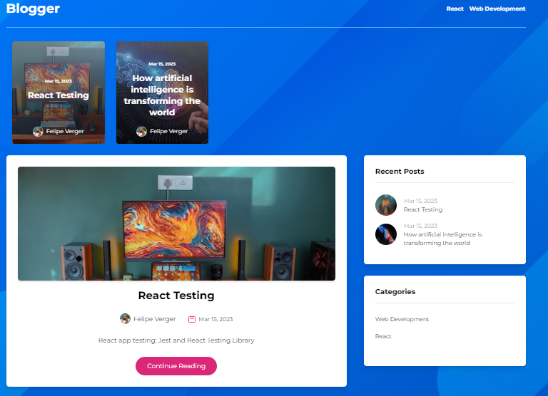

# Blogger

## What is blogger?
Blogger is a Web Application with a modern and intuitive UI. In the home page of blogger the user can view some posted blogs, if he/she is interested in one blog then the user can navigate to the blog detail page where there will be a lot more of information. Also in the home page there are some other sections like recent posts and a section to filter the blogs by categories.
In the blog detail page you can also see and know who the author of that blog is and a little biography about him. Also, there is a section to add comments to the blogs, these comments will be reviewed before actually showing them in the comments section. Lastly, there is another section with related blogs to visit.

## Most important technologies I used for this project:
- Next.js
- TailwindCSS
- GraphQL
- Hygraph

## Preview

## Deployed Version

https://blog-brown-eight.vercel.app/